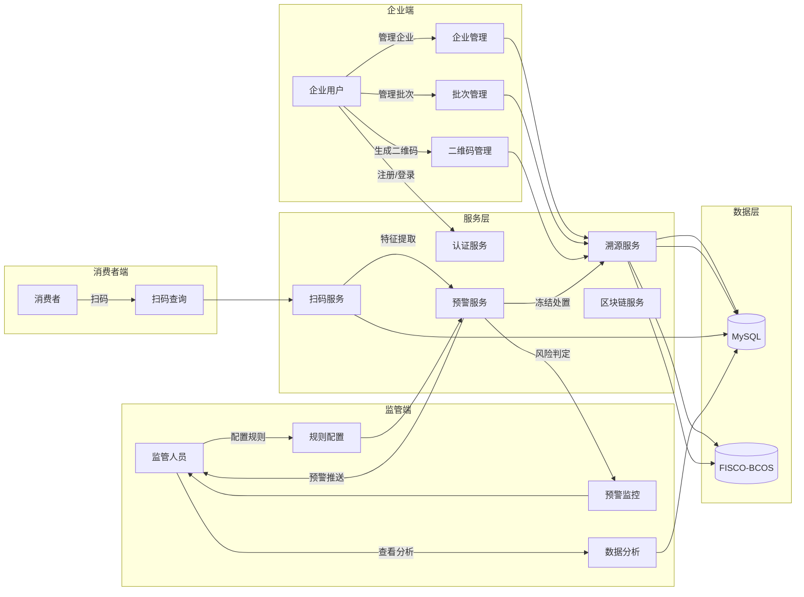
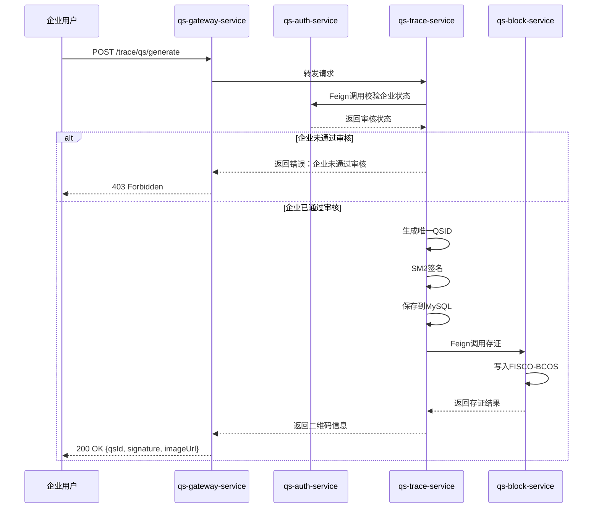
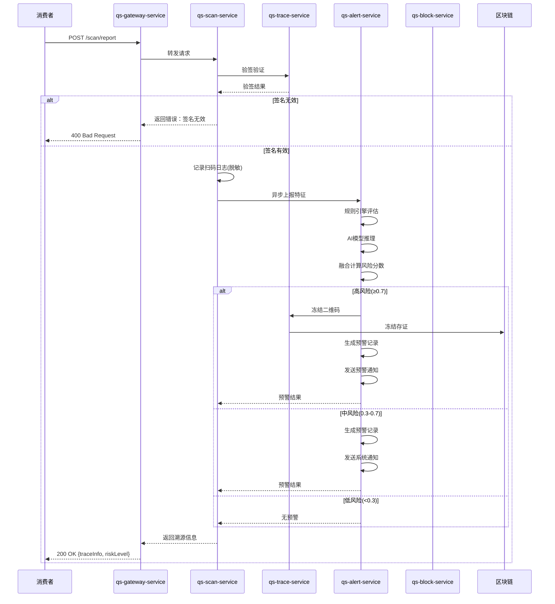
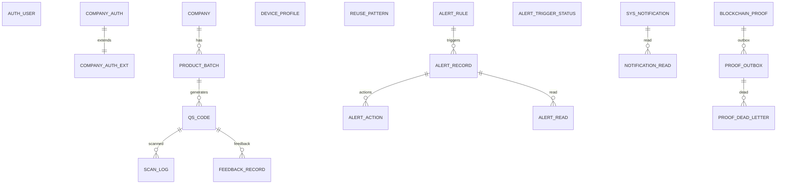

# 基于人工智能的香干质量安全预警系统

**湖南农业大学本科毕业设计（论文）**

|项目|内容|
|----|----|
|题目|基于人工智能的香干质量安全预警系统设计与实现|
|学生姓名||
|学号||
|学院|信息科学技术学院|
|专业|计算机科学与技术|
|指导教师||
|提交日期|2026年6月|

---

## 摘要

本论文围绕**基于人工智能的香干质量安全预警系统**展开，面向攸县香干生产与流通场景中“只存证、不判险、不预警”的痛点，构建了以**批次一码区块链溯源**为基础、以**规则引擎+AI异常检测**为核心的风险识别与预警闭环。系统通过扫码行为采集与多维特征提取，融合规则引擎的业务知识与AI模型对异常模式的学习能力，实现风险分级处置、预警推送与高风险二维码自动冻结，并将关键事件上链存证以保障数据可信。该系统的实现能够为香干质量安全监管提供可落地的技术方案，提升风险发现的及时性与处置的可追溯性，具有明确的现实应用价值。

**关键词**：香干质量安全；区块链溯源；规则引擎；异常检测；风险预警

---

## 目录

1. [引言](#1-引言)
    1.1 研究背景与意义
    1.2 国内外研究现状
    1.3 研究目标与内容
    1.4 论文结构安排
2. [系统需求分析](#2-系统需求分析)
    2.1 用户需求分析
    2.2 功能需求分析
    2.3 非功能需求分析
    2.4 数据流分析
    2.5 用例建模
3. [系统总体设计](#3-系统总体设计)
    3.1 系统整体架构设计
    3.2 系统技术架构设计
    3.3 系统功能结构设计
4. [系统详细设计](#4-系统详细设计)
    4.1 数据库设计
    4.2 接口设计
    4.3 关键类与方法设计
    4.4 消息队列与异步处理设计
    4.5 安全设计
5. [系统实现](#5-系统实现)
    5.1 环境配置
    5.2 核心功能实现
    5.3 AI模型训练与部署
    5.4 区块链集成
    5.5 预警通知系统
6. [系统测试](#6-系统测试)
    6.1 测试环境与工具
    6.2 功能测试
    6.3 性能测试
    6.4 安全测试
    6.5 测试结果分析
7. [结论与展望](#7-结论与展望)
    7.1 项目完成情况
    7.2 创新点总结
    7.3 不足之处
    7.4 未来展望
8. [参考文献](#8-参考文献)
9. [附录](#9-附录)

---

## 1 引言

### 1.1 研究背景与意义

随着我国经济的快速发展和人民生活水平的不断提高，食品安全问题日益成为社会关注的焦点。近年来，食品安全事件频发，不仅严重威胁消费者的身体健康，也对食品行业的健康发展造成了负面影响。据国家市场监督管理总局统计，2023年全国共查处食品安全违法案件36.5万件，涉案金额超过100亿元。这些触目惊心的数字时刻提醒着我们，食品安全监管体系的完善刻不容缓。

在当前的食品安全监管实践中，传统食品溯源系统发挥了一定的作用，但也暴露出诸多深层次的问题。首先，传统溯源系统主要侧重于信息的记录和存储，能够将食品的生产、加工、运输、销售等环节的信息完整地串联起来，但却缺乏对风险的识别和预警能力。系统只能告诉消费者食品"从哪里来"，却无法判断食品是否存在安全风险。其次，预警机制不健全是另一个突出问题。传统系统依赖人工巡检和定期抽检来发现食品安全问题，这种被动式的监管方式存在明显的滞后性，往往是等问题已经发生并造成危害后才被发现，错失了最佳干预时机。再者，数据可信性不足也是制约溯源系统发挥作用的重要因素。传统系统采用中心化的数据存储方式，数据容易被篡改，消费者对溯源信息的真实性存在疑虑。此外，现有的监管手段相对单一，主要依靠抽检，覆盖面有限，难以实现对食品安全问题的全面、实时监控。

攸县香干作为湖南省著名的地方特色农产品，以其独特的风味和传统工艺而闻名遐迩，年产量超过10万吨，产品不仅畅销全国各地，还出口到东南亚等海外市场。然而，由于生产主体分散，大部分为家庭作坊式生产，产业化程度较低，加上流通环节错综复杂，质量安全监管面临着巨大的挑战。在这样的背景下，构建一套基于人工智能的香干质量安全预警系统，将先进的信息技术与传统的食品产业相结合，实现从"存证"到"判险"再到"预警"的升级，具有重要的理论价值和应用价值。这不仅是响应国家食品安全战略的具体举措，也是推动地方特色产业规范化、品牌化发展的有力支撑。

### 1.2 国内外研究现状

在国际研究方面，相关工作沿着“可信溯源”和“智能判险”两条路径演进。2026 年，Ahmadkhan 等提出面向食品供应链的区块链信息共享方案，通过离散事件仿真评估其在减少浪费与提升协同效率方面的价值，为跨主体可信溯源提供了可量化的证据 [2]；同年，Li 等针对工业无监督异常检测提出正常性增强知识蒸馏网络，通过记忆专家机制与上下文状态空间建模缓解“正常性遗忘”，提升未知缺陷识别能力 [1]；Zhuang 等面向不平衡风险文本提出关键短语增强与异构文本图构建策略，利用图卷积网络强化高风险事件识别 [3]。2025 年，Ha 等提出定向超图神经网络用于多变量时序异常检测，能够刻画变量与变量组之间关系，提升复杂系统异常识别性能 [5]。这些研究体现了国际上在区块链可信协同与异常检测机理方面的持续深化。

在国内研究方面，溯源系统建设与联盟链技术结合逐渐成熟。2025 年，马元元等基于 FISCO BCOS 设计农产品溯源系统，提出三级架构与 17 个智能合约，并融合 IPFS 与结构化事件/哈希锚定策略以提升海量数据上链效率 [8]；同年，李羽等构建基于 FISCO BCOS 的线上智能签约系统，验证了联盟链在身份认证、合约自动执行与可追溯性保障方面的工程可行性 [9]。2023 年，张雅倩构建“物联网监测+二维码标识+区块链网络”的多子平台溯源体系，并提出主链+子链与多数据库协同存储方案，增强数据来源可信与系统扩展性 [13]；徐靖围绕农业生产管理提出 Drools 规则引擎驱动的规则库与流程模型，为规则驱动的过程管理提供了可迁移经验 [14]；杜星熠等在物联网数据查询中优化 Drools 规则架构，降低冗余匹配并提升大数据量查询效率 [15]；王建涛等对“区块链+溯源”防伪研究进行综述，指出现有系统多聚焦防伪与存证，风险预警闭环仍有不足 [16]。上述研究为可信存证与规则管理奠定了工程基础，但多集中在“可追溯”和“可验证”层面。

在智能风险识别与模型融合方面，国内外研究持续推进。2025 年，吴笑天等提出双通道特征融合方法，将时序信号与图像特征结合以提升故障区域辨识精度 [10]；刘秀玥等提出双阶段双通道多头自注意力故障分类模型，融合 GRU/LSTM 时序表征与动态核 PCA 统计特征，以增强对微弱异常的敏感度 [4]。2025 年，郭宇昊面向云原生运维提出多源可观测性数据与时序动态图结合的异常检测方案，解决动态拓扑下的特征融合与权重调节问题 [11]；2024 年，张崇提出基于异构图神经网络的企业风险预测模型，融合内外部风险特征并引入注意力与 Transformer 机制提升预测性能 [12]。此外，知识蒸馏在模型轻量化与性能保持方面不断演进：2024 年舒善富等提出自适应知识蒸馏以缓解 KL/RKL 的互补性问题 [6]，崔学英等通过双知识蒸馏与多尺度特征学习提升 Transformer 分类性能 [7]。这些研究为“规则+模型”协同判险提供了方法论参考，但在食品安全预警场景的落地仍较少。

综合来看，现有研究在可信溯源、异常检测与规则引擎应用方面各有突破，但仍存在三方面不足：其一，多数溯源系统停留在“存证可查”，缺乏“判险与预警”能力的闭环设计；其二，规则引擎与 AI 模型的协同机制不完善，难以形成实时融合判定；其三，食品安全场景中的多源异构数据与隐私安全问题仍缺少工程化解决方案。基于此，本文围绕“存证+判险+预警”的一体化目标，探索区块链可信存证与 AI 风险评估、规则引擎协同的系统化实现路径，为香干质量安全预警提供可落地的技术方案。

### 1.3 研究目标与内容

本研究的核心目标是构建一套集溯源、风控、预警于一体的香干质量安全预警系统，实现从"被动抽检"到"主动预警"的根本转变，使监管部门能够及时发现和处理食品安全风险，保障人民群众"舌尖上的安全"。

围绕这一目标，本研究的主要内容包括以下几个方面。首先是需求分析与架构设计阶段，通过深入调研攸县香干产业的实际需求，明确系统的功能定位和非功能指标，设计合理的系统架构，形成完整的需求规格说明书和系统架构图。其次是核心功能开发阶段，完成溯源模块、扫码模块、预警模块等主要功能模块的开发工作，实现企业认证、批次管理、二维码生成、扫码日志采集、风险评估、预警推送等核心业务流程。第三是人工智能模型训练与集成阶段，收集和整理历史扫码数据，构建用于风险检测的机器学习模型，并将训练好的模型转换为ONNX格式，集成到预警服务中，实现基于AI的风险判定。第四是区块链存证集成阶段，搭建FISCO-BCOS区块链环境，开发存证接口和核验接口，将二维码创建、预警事件、冻结动作等关键数据上链存证，保障数据的不可篡改性。第五是系统测试与优化阶段，通过功能测试、性能测试、安全测试等多种手段全面验证系统的正确性和可靠性，并根据测试结果进行针对性优化，形成完整的测试报告。

### 1.4 论文结构安排

本论文共分为九章，各章节内容安排如下：第一章引言部分主要介绍研究背景、国内外研究现状、研究目标与内容以及论文的结构安排，为后续章节的论述奠定基础；第二章系统需求分析部分详细分析业务需求、功能需求、非功能需求，绘制数据流图和用例图，明确系统的边界和功能范围；第三章系统总体设计部分介绍系统的架构设计、技术选型、关键设计决策和核心业务流程，从宏观层面把握系统的整体架构；第四章系统详细设计部分详细设计数据库结构、接口规范、类与方法以及安全机制，为系统实现提供具体的技术方案；第五章系统实现部分详细描述系统的实现过程，展示核心代码，给出关键技术的实现细节；第六章系统测试部分介绍测试环境与工具、功能测试、性能测试、安全测试的过程和结果，分析测试覆盖率；第七章结论与展望部分总结研究成果和创新点，分析存在的不足，展望未来的研究方向；第八章列出参考文献；第九章为附录部分，包含缩略语说明和系统部署说明。

---

## 2 系统需求分析

### 2.1 用户需求分析

本系统面向企业用户、监管人员和普通消费者三类角色，用户需求体现为业务目标、操作诉求与使用场景的差异化，同时对可用性、时效性与可追溯性提出更高要求。

**企业用户需求**主要集中在合规入驻、批次管理与溯源赋码三类：一是企业需完成注册与资质提交，并实时查看审核进度，确保入驻流程透明可控；二是生产侧需便捷创建与维护批次信息，保证批次与产品信息的完整记录，支持后续抽查与追溯；三是需快速生成与下载二维码，并在后续运营中查看扫码统计与预警处置结果，以便及时调整生产与流通策略。同时企业希望减少人工录入成本，提升发码效率，并对异常扫码或风险预警有清晰的处置建议与结果反馈。

**监管人员需求**围绕“可视化监测+可追溯处置”展开：一是对入驻企业进行资质审核与状态管理，形成准入闭环；二是实时掌握预警信息，查看风险等级、风险分数及触发规则，支撑快速研判；三是对高风险二维码执行冻结/放行等处置操作并留存证据链；四是基于统计分析掌握风险态势，为监管策略优化提供数据依据。监管侧还需要统一的事件追踪视图，能够按企业、批次、区域或时间维度进行筛查与对比，提升执法和监督的准确性。

**消费者需求**以“扫码可查+异常可报”为核心：消费者希望通过扫码快速获取产品溯源信息与风险状态，并在发现异常时能够便捷反馈问题，形成社会监督的补充入口。同时期望扫码页面加载快、信息表达清晰，能够直观识别产品是否存在风险提示，并获得简单明确的处理建议。

### 2.2 功能需求分析

在前述用户需求分析的基础上，系统功能从业务流程与角色职责两方面进行抽象与归纳，形成可实施的功能框架，保证系统在企业、监管与消费者三类场景下具备可用性与可操作性。

系统功能需求围绕“企业准入—批次管理—二维码溯源—扫码采集—风险预警—处置闭环”的业务链路展开，强调流程清晰、信息完整、结果可追溯。企业端主要承担生产与溯源基础数据的维护任务，系统应支持企业注册与资质提交，提供审核进度与状态通知；支持企业档案与产品信息维护，形成可追溯的基础资料；支持批次创建、查询与生命周期管理，保证批次信息与产品一致；支持按批次生成二维码并提供下载、导出与状态管理能力，满足发码与流通环节的实际需求；同时提供扫码统计与异常提示的经营视图，便于企业及时优化生产与流通策略。

监管端以审核与预警处置为核心。系统应支持企业资质审核与状态流转记录，保证准入可控；支持预警列表与风险详情查看，包括风险等级、触发依据与关联批次；支持对高风险二维码执行冻结、放行或复核并留存处置结果，形成闭环；同时提供规则管理与统计分析能力，便于监管人员根据实际风险态势进行规则调整与监管策略优化。

消费者端关注“扫码可查、异常可报”。系统应提供扫码查询入口，展示溯源信息、生产批次与风险提示；支持异常反馈提交，形成可追踪记录；并提供处理进度与系统提示的查询，以增强消费者对溯源信息的理解与信任。整体功能设计既满足监管合规要求，也兼顾企业运营与消费者监督的实际使用场景。

### 2.3 非功能需求分析

系统除满足业务功能外，还需在性能、安全、可靠性、可维护性与兼容性方面达到一定要求。性能上，扫码接口应保持较低响应时间，风险评估接口应在可接受范围内完成计算，并保证规则调整后的生效时效与并发处理能力，以支撑高频扫码与实时预警场景。安全方面，二维码生成采用 SM2 数字签名保证不可伪造，敏感信息进行脱敏存储，并通过 JWT 完成身份认证与权限控制，确保不同角色访问边界清晰。可靠性上，预警推送具备失败重试机制，关键业务数据需持久化并满足保存期限要求，关键流程异常可记录、可追踪。可维护性方面，系统应采用模块化设计与统一日志规范，规则配置支持在线调整，避免频繁停机发布。兼容性方面，前端需适配主流浏览器与移动端扫码场景，保证不同终端访问体验一致。

### 2.4 数据流分析

**核心数据流图（Level 1）：**




系统的核心数据流是从扫码请求开始，经过验签、日志记录、风险评估，最终到预警生成和处置的完整过程。

当消费者扫描产品上的二维码时，前端会向系统发送扫码请求，请求中包含二维码的唯一标识符QSID、SM2签名信息、设备指纹、IP地址、经纬度坐标等数据。网关服务接收请求后进行初步的路由转发，将请求分发到扫码服务进行处理。扫码服务首先调用溯源服务的验签接口，对二维码的SM2签名进行验证，确保二维码的真实性和有效性。如果验签失败，说明二维码可能被篡改或伪造，系统直接返回错误信息。如果验签通过，扫码服务会继续查询二维码的详细信息，检查二维码的当前状态，如果二维码已被冻结则拒绝扫码请求。

验签通过后，扫码服务会将扫码日志写入数据库，日志内容包括二维码标识、批次标识、企业标识、设备指纹、浏览器信息、脱敏后的IP地址、经纬度坐标、地理解析结果、扫码时间等。扫码日志的记录是后续风险评估的基础数据来源，系统通过对历史扫码数据的统计分析来识别异常行为模式。

与此同时，扫码服务还会异步调用预警服务的特征上报接口，将从扫码日志中统计得到的特征数据发送给预警服务。预警服务接收特征数据后，同时启动规则引擎评估和AI模型推理两个通道的计算流程。规则引擎根据预设的阈值条件对特征数据进行匹配，计算出规则引擎的风险分数。AI模型则基于训练好的机器学习模型对特征数据进行推理，输出AI模型的风险分数。两个分数按照设定的权重进行融合计算，得出最终的综合风险分数。系统根据综合风险分数确定对应的风险等级。

如果风险等级为中风险或高风险，预警服务会生成预警记录并存入数据库。对于高风险的情况，系统还会自动触发二维码冻结操作，将二维码的状态修改为冻结，同时将冻结动作上链存证。预警服务还会调用通知网关，发送预警信息給监管人员。如果风险等级为低风险，系统仅进行日志记录，不生成预警也不触发后续处置流程。整个数据流程中，数据在各个服务之间流转，最终返回给消费者端的是溯源查询结果和当前二维码的风险等级信息。

### 2.5 用例建模

本系统涉及的主要参与者包括企业用户、监管人员和普通消费者三类，不同的参与者与系统之间存在多种交互关系，形成了系统的用例模型。

企业用户与系统之间的交互主要包括以下几个用例：企业注册用例用于企业用户首次入驻系统时提交入驻申请和资质材料；资质审核用例用于监管人员对企业提交的资质材料进行审核，企业用户可以查询审核进度和审核结果；批次管理用例用于企业用户创建和管理产品生产批次信息；二维码生成用例用于企业用户为特定批次生成溯源二维码，这是企业用户最核心的业务功能。

监管人员与系统之间的交互主要包括以下几个用例：企业资质审核用例是监管人员的核心职责之一，用于审核企业提交的入驻申请；预警监控用例用于监管人员实时查看系统产生的各类预警事件，了解当前的风险态势；预警处置用例用于监管人员对已生成的预警进行处理，决定是否冻结相关的二维码；规则配置用例用于监管人员对风险判定规则进行管理，包括添加新规则、修改规则参数、启用停用规则等操作。

普通消费者与系统之间的交互相对简单，主要包括扫码查询用例用于消费者通过扫描二维码获取产品溯源信息，以及异常反馈用例用于消费者向监管部门反馈产品存在的质量问题或异常情况。

在关键用例的详细描述方面，以二维码生成用例为例，其前置条件是企业用户已经通过资质审核并在系统中处于正常状态。主流程包括以下步骤：企业用户选择需要生成二维码的产品批次，系统验证企业用户的操作权限，系统生成唯一的二维码标识符，系统使用SM2算法对二维码信息进行数字签名，系统将二维码信息存储到数据库，系统调用区块链服务将二维码信息上链存证，系统返回二维码的图片和相关信息给企业用户。异常流程主要体现在如果企业未通过资质审核，系统会拒绝生成二维码的请求并返回相应的错误信息。

---

## 3 系统总体设计

### 3.1 系统整体架构设计

本系统采用分层与微服务相结合的总体架构，以“数据可信存证、风险智能判定、预警联动处置”为主线构建闭环能力。整体上，架构由展现层、服务层与数据层组成，各层职责明确、相互协同，既保证数据可信与业务解耦，也方便后续扩展与运维，能够覆盖企业生产管理、监管执法与消费者查询等多场景需求。

数据层负责业务数据与存证数据的统一管理，既包含关系型数据库，也包含联盟链存储。关系型数据库用于沉淀企业信息、批次信息、二维码、扫码日志与预警记录等结构化数据，确保业务一致性与可追溯性，并支持高频查询、统计分析与报表输出；区块链层侧重保存二维码创建、预警事件与冻结处置等关键操作的哈希与证据链信息，强化数据不可篡改能力，并支持后续核验与责任追溯，形成“可查、可证、可追”的可信基础。

服务层在网关统一入口的基础上进行功能拆分，认证、溯源、扫码、预警、区块链等服务相互独立又通过 HTTP/Feign 同步调用与异步任务协作，形成完整的业务流转链路。该层承担规则执行、特征计算、模型推理、风险融合与处置联动等核心处理任务，是系统的业务中枢，同时通过服务解耦与故障隔离提升整体稳定性与可维护性。

展现层面向企业端、监管端与消费者端提供统一访问入口，采用前后端分离模式，前端负责业务交互与可视化展示，后端提供标准化 RESTful API。展现层兼顾多终端访问与扫码场景适配，确保不同角色在各自使用场景下获得一致、稳定的体验，并通过清晰的信息呈现与操作流程提升系统可用性。

### 3.2 系统技术架构设计

系统技术架构围绕“微服务治理 + 可信存证 + 规则与模型融合”展开，主要包括前端、后端、数据与基础设施四部分。

**前端技术**采用 Vue 作为核心框架，结合组件化开发实现企业管理、监管预警与消费者扫码查询页面；通过路由管理实现单页应用结构，使用异步加载提升首屏性能；通过 HTTP 客户端与后端接口进行 JSON 数据交互。

**后端技术**采用 Spring Boot + Spring Cloud 构建微服务体系，实现服务注册发现、统一网关、配置管理与链路调用；采用 Drools 规则引擎实现风险规则热更新，使用 ONNX Runtime 进行 AI 模型推理，形成规则与模型双通道融合。

**数据与存证**采用 MySQL 存储业务数据，FISCO-BCOS 联盟链存储关键事件证据；采用 SM2 数字签名确保二维码可信，链上仅保存必要字段与哈希，降低链上负载。

**基础设施**通过 Nacos 提供配置与注册中心，结合日志与监控组件实现运行可观测性；通过异步任务与重试机制提升系统稳定性与容错能力。

### 3.3 系统功能结构设计

系统功能结构以“溯源为基础、预警为核心、处置为闭环”为设计原则，划分为五个功能模块。

**企业与认证管理模块**：支持企业入驻、资质审核、企业信息管理与状态流转，保障企业准入合规。

**批次与二维码管理模块**：支持批次创建与维护、二维码生成与验签、二维码状态管理（启用/禁用/冻结）以及二维码生命周期统计。

**扫码采集与日志模块**：采集扫码时间、地点、设备与网络特征，完成脱敏与地理解析，为风险评估提供特征基础。

**风险评估与预警模块**：基于规则引擎与 AI 模型进行风险评分与等级判定，生成预警记录并触发通知推送与处置动作。

**区块链存证与核验模块**：对二维码创建、预警事件、冻结处置等关键行为上链存证，提供证据链查询与可信核验能力。

### 3.4 核心业务流程

#### 3.4.1 二维码生成流程

二维码生成是企业用户的核心业务操作，其流程设计需要兼顾安全性和效率。当企业用户请求生成二维码时，整个流程包括身份验证、权限校验、信息生成、签名计算、数据存储、链上存证等多个环节。

企业用户首先通过前端界面向网关服务发送二维码生成请求，请求中携带批次标识和企业标识等信息。网关服务对请求进行初步处理，验证JWT令牌的有效性，然后将请求转发给溯源服务。溯源服务接收到请求后，首先调用认证服务查询该企业的审核状态，只有审核状态为"已通过"的企业才能继续后续操作。如果企业未通过审核或正在审核中，溯源服务会返回错误信息，整个流程终止。

审核状态验证通过后，溯源服务开始生成二维码的具体逻辑。系统首先生成一个唯一的二维码标识符，采用"QS"前缀加时间戳和随机数的格式，确保标识符的唯一性和可读性。然后系统构建签名原文，包含二维码标识、批次标识、企业标识和时间戳等字段，这些字段拼接成字符串后进行SM2数字签名。SM2签名算法是我国自主设计的非对称加密算法，具有安全性高、签名速度快等优点。签名完成后，二维码的完整信息被保存到数据库中，包括标识符、关联的批次和企业、签名数据、创建时间等字段。

二维码信息保存完成后，溯源服务会调用区块链服务的存证接口，将二维码的标识和签名数据写入区块链。区块链服务首先计算数据的哈希值，然后将哈希值和原始数据打包成交易，发送到FISCO-BCOS联盟链上进行记账。链上记账完成后，区块链服务返回区块高度和交易哈希等链上信息，溯源服务将这些信息也保存到本地数据库中，便于后续的存证核验。最后，溯源服务将二维码的标识、签名、图片访问URL等信息返回给前端，企业用户可以下载二维码图片并将其印刷到产品包装上。

#### 



#### 

#### 3.4.2 扫码与风险评估流程

扫码是消费者与系统交互的主要方式，当消费者扫描产品上的二维码时，系统需要完成签名验证、日志记录、风险评估、结果返回等一系列操作，整个过程需要在保证安全性的同时尽可能快速响应。

消费者使用微信或其他扫码工具扫描产品上的二维码后，扫码工具会访问二维码中嵌入的URL地址，该地址指向网关服务的扫码接口。网关服务接收请求后进行路由转发，将请求发送给扫码服务。扫码服务首先从请求中提取二维码标识和SM2签名信息，然后调用溯源服务的验签接口进行签名验证。验签是确保二维码真实性的关键步骤，系统使用SM2公钥对签名原文进行解密和比对，如果签名验证失败，说明二维码可能被篡改或伪造，系统会直接返回错误信息。

验签通过后，扫码服务继续查询二维码的详细信息，包括所属企业、关联批次、当前状态等。如果二维码已经被冻结，说明该产品存在安全风险，系统会返回冻结提示信息，告知消费者该产品已下架。如果二维码处于正常状态，扫码服务会执行日志记录操作，将扫码的时间、地点、设备信息、IP地址等数据存入数据库。日志记录是风险评估的数据来源，系统通过对扫码数据进行统计分析，提取特征用于风险判定。同时，扫码服务会对IP地址等敏感信息进行脱敏处理，只保存脱敏后的数据，保护消费者隐私。

日志记录完成后，扫码服务会异步调用预警服务的风险评估接口，提交从扫码日志提取的特征数据。风险评估是整个流程中最耗时的操作，因此采用异步方式进行处理，避免阻塞扫码请求的响应。预警服务接收到特征数据后，同时启动规则引擎评估和AI模型推理两个通道，根据融合计算得出风险分数和风险等级。如果风险等级为高风险，系统会自动将二维码状态修改为冻结，并向监管人员发送预警通知。如果风险等级为中风险，系统仅生成预警记录并发送系统消息。如果风险等级为低风险，系统仅进行日志记录，不触发预警流程。

整个扫码流程的最后，扫码服务将溯源查询结果和当前的风险等级返回给前端，前端根据返回结果展示相应的页面。消费者可以看到产品的详细信息，同时也能了解到该产品的风险评估结果。



---

## 4 系统详细设计

### 4.1 数据库设计

#### 4.1.1 数据库概要设计

本系统数据库围绕“企业资质准入—生产批次—二维码溯源—扫码日志—风险预警—区块链存证”的主链路设计，采用分库分域的方式隔离不同业务场景。认证域负责账号与企业资质审核，溯源域负责企业主档、批次与二维码主数据，扫码域记录扫码行为与消费者反馈，预警域管理规则、预警记录与通知，存证域保存链上存证与异步投递，画像与特征域则支撑设备画像与风险特征统计。各域之间通过企业、批次、二维码等业务标识建立逻辑关联，服务之间以接口联动而非跨库外键，既保证解耦，也便于扩展。

在认证域，系统需要记录账号信息与角色权限，支撑管理员、企业与消费者的差异化访问；同时覆盖企业入驻申请、资质材料与审核流程，确保只有通过审核的企业进入发码与溯源环节，从源头保证数据可信。溯源域以企业基础信息为核心，配套生产批次的合规信息与二维码主数据，支持验签、冻结与生命周期管理，为监管检查提供可靠的可追溯依据。扫码与反馈域侧重行为数据与社会监督信息的沉淀，完整记录扫码时间、设备与地理信息等关键要素，并保留异常反馈与处理状态，为风险评估提供原始数据输入。设备画像与特征统计用于沉淀设备常驻地、风险标记及二维码复用等特征，为模型推理提供结构化特征支撑。

预警域以规则与预警事件为核心，配套处置动作、已读状态与通知管理，实现风险识别与处置闭环；存证域用于保存二维码生成、冻结处置与预警事件等关键证据，结合异步投递与失败追踪机制，保证上链过程可重试、可回溯。整体上，各表均采用主键唯一标识，按企业、批次、二维码等业务标识建立逻辑关联，字段类型依据业务选型，并在扫码时间、企业、风险等级等高频条件上建立索引以提升查询效率。该设计能够覆盖从发码、扫码到预警处置的完整流程，并在分库前提下保持一致性与可扩展性。

#### 4.1.2 ER 图



---

## 5 系统实现

系统实现阶段是将设计阶段成果转化为可运行软件的关键环节，本章将从环境配置、核心功能实现、AI模型训练与部署、区块链集成以及预警通知系统五个方面详细描述系统的具体实现过程。在环境配置部分，将介绍项目依赖的Maven配置和关键的配置文件内容。在核心功能实现部分，将展示主要业务逻辑的代码实现，包括二维码生成、SM2签名、扫码日志采集、风险评估等核心功能的具体代码。在AI模型训练与部署部分，将描述模型的训练过程、特征工程、模型转换和ONNX部署等环节。在区块链集成部分，将介绍FISCO-BCOS的配置、存证接口开发和防篡改验证实现。在预警通知系统部分，将描述邮件推送、短信推送和多渠道通知的实现细节。

### 5.1 环境配置

#### 5.1.1 Maven依赖配置

```xml
<!-- pom.xml 核心依赖 -->
<parent>
    <groupId>org.springframework.boot</groupId>
    <artifactId>spring-boot-starter-parent</artifactId>
    <version>3.0.0</version>
</parent>

<properties>
    <java.version>17</java.version>
    <spring-cloud.version>2022.0.3</spring-cloud.version>
    <drools.version>7.59.0.Final</drools.version>
</properties>

<dependencies>
    <!-- Spring Boot Starter -->
    <dependency>
        <groupId>org.springframework.boot</groupId>
        <artifactId>spring-boot-starter-web</artifactId>
    </dependency>
    
    <!-- Spring Security -->
    <dependency>
        <groupId>org.springframework.boot</groupId>
        <artifactId>spring-boot-starter-security</artifactId>
    </dependency>
    
    <!-- Spring Cloud -->
    <dependency>
        <groupId>org.springframework.cloud</groupId>
        <artifactId>spring-cloud-starter-gateway</artifactId>
    </dependency>
    <dependency>
        <groupId>org.springframework.cloud</groupId>
        <artifactId>spring-cloud-starter-openfeign</artifactId>
    </dependency>
    <dependency>
        <groupId>com.alibaba.cloud</groupId>
        <artifactId>spring-cloud-starter-alibaba-nacos-discovery</artifactId>
        <version>2022.0.0.0-RC2</version>
    </dependency>
    
    <!-- MyBatis Plus -->
    <dependency>
        <groupId>com.baomidou</groupId>
        <artifactId>mybatis-plus-boot3-starter</artifactId>
        <version>3.5.5</version>
    </dependency>
    
    <!-- MySQL Driver -->
    <dependency>
        <groupId>com.mysql</groupId>
        <artifactId>mysql-connector-j</artifactId>
        <scope>runtime</scope>
    </dependency>
    
    <!-- Drools规则引擎 -->
    <dependency>
        <groupId>org.drools</groupId>
        <artifactId>drools-core</artifactId>
        <version>${drools.version}</version>
    </dependency>
    <dependency>
        <groupId>org.drools</groupId>
        <artifactId>drools-compiler</artifactId>
        <version>${drools.version}</version>
    </dependency>
    
    <!-- JWT -->
    <dependency>
        <groupId>io.jsonwebtoken</groupId>
        <artifactId>jjwt-api</artifactId>
        <version>0.12.3</version>
    </dependency>
    <dependency>
        <groupId>io.jsonwebtoken</groupId>
        <artifactId>jjwt-impl</artifactId>
        <version>0.12.3</version>
        <scope>runtime</scope>
    </dependency>
    <dependency>
        <groupId>io.jsonwebtoken</groupId>
        <artifactId>jjwt-jackson</artifactId>
        <version>0.12.3</version>
        <scope>runtime</scope>
    </dependency>
    
    <!-- ONNX Runtime -->
    <dependency>
        <groupId>com.microsoft.onnxruntime</groupId>
        <artifactId>onnxruntime</artifactId>
        <version>1.16.3</version>
    </dependency>
    
    <!-- 国密SM2 -->
    <dependency>
        <groupId>org.bouncycastle</groupId>
        <artifactId>bcprov-jdk18on</artifactId>
        <version>1.76</version>
    </dependency>
    
    <!-- Spring Mail -->
    <dependency>
        <groupId>org.springframework.boot</groupId>
        <artifactId>spring-boot-starter-mail</artifactId>
    </dependency>
    
    <!-- Lombok -->
    <dependency>
        <groupId>org.projectlombok</groupId>
        <artifactId>lombok</artifactId>
    </dependency>
</dependencies>

<dependencyManagement>
    <dependencies>
        <dependency>
            <groupId>org.springframework.cloud</groupId>
            <artifactId>spring-cloud-dependencies</artifactId>
            <version>${spring-cloud.version}</version>
            <type>pom</type>
            <scope>import</scope>
        </dependency>
    </dependencies>
</dependencyManagement>
```

#### 5.1.2 application.yml 配置示例

```yaml
server:
  port: 9094

spring:
  application:
    name: qs-alert-service
  profiles:
    active: dev
  
  datasource:
    url: jdbc:mysql://localhost:3306/yx_alert_engine?useUnicode=true&characterEncoding=utf8&serverTimezone=Asia/Shanghai&useSSL=false
    username: root
    password: 123456
    driver-class-name: com.mysql.cj.jdbc.Driver
    hikari:
      maximum-pool-size: 20
      minimum-idle: 5
      idle-timeout: 300000
      connection-timeout: 20000
  
  mail:
    host: smtp.qq.com
    port: 587
    username: your_email@qq.com
    password: your_email_password
    protocol: smtp
    default-encoding: UTF-8
    properties:
      mail:
        smtp:
          auth: true
          starttls:
            enable: true
          timeout: 5000

  cloud:
    nacos:
      discovery:
        server-addr: localhost:8848
      config:
        server-addr: localhost:8848
        file-extension: yml

mybatis-plus:
  configuration:
    map-underscore-to-camel-case: true
    log-impl: org.apache.ibatis.logging.stdout.StdOutImpl
  global-config:
    db-config:
      id-type: auto

app:
  ai:
    model-path: ${AI_MODEL_PATH:classpath:qs_risk_model.onnx}
    positive-class-index: 1
    output-kind: prob
  rules:
    refresh-ms: 10000
    initial-delay-ms: 3000
  notification:
    retry-once: true
    mail:
      enabled: true
      to: admin@example.com
      subject-prefix: "[QS-ALERT]"
      detail-url: http://localhost:5173/#/admin/alert/detail
    sms:
      enabled: false
      gateway-url:
      to:
      api-key:
  integration:
    trace-freeze-url: http://localhost:9092/trace/qs/%s/status/internal
    block-event-url: http://localhost:9095/block/proof/event
```

### 5.2 核心功能实现

#### 5.2.1 二维码生成与SM2签名

```java
// QsCodeService.java
@Service
public class QsCodeService {
    
    private final QsCodeMapper qsCodeMapper;
    private final TraceFeignClient traceFeignClient;
    private final BlockFeignClient blockFeignClient;
    
    @Value("${app.sign.sm2-private-key}")
    private String sm2PrivateKey;
    
    public QsCode generate(String batchId, String companyId) {
        // 1. 校验企业认证状态
        R<Map<String, Object>> authStatus = traceFeignClient.checkCompanyAuth(companyId);
        if (!authStatus.isSuccess() || !"APPROVED".equals(authStatus.getData().get("status"))) {
            throw new BusinessException("企业未通过认证审核，无法生成二维码");
        }
        
        // 2. 查询批次信息
        R<Map<String, Object>> batchInfo = traceFeignClient.getBatchInfo(batchId);
        if (!batchInfo.isSuccess()) {
            throw new BusinessException("批次不存在");
        }
        
        // 3. 生成唯一二维码标识符
        String qsId = IdFormatUtil.generateQsId();
        
        // 4. 构建签名原文
        String payload = qsId + batchId + companyId + System.currentTimeMillis();
        
        // 5. SM2签名
        String signature = Sm2Util.sign(payload, sm2PrivateKey);
        
        // 6. 创建二维码对象
        QsCode qsCode = new QsCode();
        qsCode.setQsId(qsId);
        qsCode.setBatchId(batchId);
        qsCode.setCompanyId(companyId);
        qsCode.setStatus(QsCodeStatus.ACTIVE.name());
        qsCode.setSignature(signature);
        qsCode.setSignaturePayload(payload);
        qsCode.setScanCount(0);
        
        // 7. 保存到数据库
        qsCodeMapper.insert(qsCode);
        
        // 8. 区块链存证
        try {
            blockFeignClient.saveQrProof(qsId, signature, payload);
        } catch (Exception e) {
            log.warn("区块链存证失败: {}", e.getMessage());
        }
        
        log.info("二维码生成成功: qsId={}, batchId={}, companyId={}", qsId, batchId, companyId);
        return qsCode;
    }
}
```

#### 5.2.2 SM2签名工具类

```java
// Sm2Util.java
public class Sm2Util {
    
    private static final String EC_CURVE = "sm2p256v1";
    
    public static String sign(String data, String privateKeyHex) {
        try {
            Security.addProvider(new BouncyCastleProvider());
            
            // 解析私钥
            byte[] privateKeyBytes = Hex.decode(privateKeyHex);
            ECPrivateKeyParameters privateKey = ECUtil.generatePrivateKeyParameter(privateKeyBytes);
            
            // 创建签名器
            Signer signer = new JcaSignerBuilder()
                    .setProvider("BC")
                    .setSignatureAlgorithm("SM2WITHECDSA")
                    .build(privateKey);
            
            // 签名
            signer.update(data.getBytes(StandardCharsets.UTF_8), 0, data.length());
            byte[] signature = signer.generateSignature();
            
            return Hex.toHexString(signature);
        } catch (Exception e) {
            throw new RuntimeException("SM2签名失败: " + e.getMessage(), e);
        }
    }
    
    public static boolean verify(String data, String signature, String publicKeyHex) {
        try {
            Security.addProvider(new BouncyCastleProvider());
            
            byte[] publicKeyBytes = Hex.decode(publicKeyHex);
            ECPublicKeyParameters publicKey = ECUtil.generatePublicKeyParameter(publicKeyBytes);
            
            Signer verifier = new JcaSignerBuilder()
                    .setProvider("BC")
                    .setSignatureAlgorithm("SM2WITHECDSA")
                    .build(publicKey);
            
            verifier.update(data.getBytes(StandardCharsets.UTF_8), 0, data.length());
            return verifier.verifySignature(Hex.decode(signature));
        } catch (Exception e) {
            log.warn("SM2验签失败: {}", e.getMessage());
            return false;
        }
    }
}
```

#### 5.2.3 扫码日志采集与风险评估

```java
// ScanController.java
@RestController
@RequestMapping("/scan")
public class ScanController {
    
    private final ScanLogService scanLogService;
    private final TraceFeignClient traceFeignClient;
    private final AlertFeignClient alertFeignClient;
    
    @PostMapping("/report")
    public R<?> report(@RequestBody ScanRequest request) {
        try {
            // 1. SM2验签验证
            boolean valid = traceFeignClient.verifySignature(
                request.getSignaturePayload(), 
                request.getSignature()
            );
            if (!valid) {
                log.warn("二维码签名无效: qsId={}", request.getQsId());
                return R.fail("二维码签名无效");
            }
            
            // 2. 查询二维码信息
            R<Map<String, Object>> qrInfo = traceFeignClient.getQsInfo(request.getQsId());
            if (!qrInfo.isSuccess()) {
                return R.fail("二维码不存在");
            }
            
            Map<String, Object> qrData = qrInfo.getData();
            String status = (String) qrData.get("status");
            if ("frozen".equals(status)) {
                return R.fail("二维码已被冻结");
            }
            
            // 3. 记录扫码日志
            ScanLog log = new ScanLog();
            log.setQsId(request.getQsId());
            log.setBatchId(request.getBatchId());
            log.setCompanyId(request.getCompanyId());
            log.setDeviceFingerprint(request.getDeviceFingerprint());
            log.setBrowser(request.getBrowser());
            log.setIpMasked(MaskUtil.maskIp(request.getIp()));
            log.setLatitude(request.getLatitude());
            log.setLongitude(request.getLongitude());
            log.setIsFirstScan((Integer) qrData.get("scanCount") == 0 ? 1 : 0);
            log.setScanTime(new Date());
            
            // 解析地理位置
            if (request.getLatitude() != null && request.getLongitude() != null) {
                Map<String, String> geoInfo = GeoUtil.reverseGeocode(
                    request.getLatitude(), 
                    request.getLongitude()
                );
                log.setCity(geoInfo.get("city"));
                log.setProvince(geoInfo.get("province"));
            }
            
            scanLogService.save(log);
            
            // 4. 异步触发风险评估
            CompletableFuture.runAsync(() -> {
                try {
                    alertFeignClient.evaluate(buildEvaluateRequest(request));
                } catch (Exception e) {
                    log.error("异步风险评估失败: {}", e.getMessage());
                }
            });
            
            // 5. 返回溯源信息
            Map<String, Object> result = new HashMap<>();
            result.put("traceInfo", qrData);
            result.put("riskLevel", "LOW");
            result.put("riskScore", 0.0);
            
            return R.ok(result);
            
        } catch (Exception e) {
            log.error("扫码处理失败: {}", e.getMessage());
            return R.fail("扫码处理失败");
        }
    }
    
    private AlertEvaluateRequest buildEvaluateRequest(ScanRequest request) {
        // 从扫码日志统计特征
        Map<String, Object> stats = scanLogService.getScanStats(request.getQsId());
        
        AlertEvaluateRequest evaluateRequest = new AlertEvaluateRequest();
        evaluateRequest.setQsId(request.getQsId());
        evaluateRequest.setCompanyId(request.getCompanyId());
        evaluateRequest.setScanCount1h((Integer) stats.get("scanCount1h"));
        evaluateRequest.setDeviceCount1d((Integer) stats.get("deviceCount1d"));
        evaluateRequest.setIpCount1h((Integer) stats.get("ipCount1h"));
        evaluateRequest.setTimeVariance((Double) stats.get("timeVariance"));
        evaluateRequest.setLocationVariance((Double) stats.get("locationVariance"));
        
        return evaluateRequest;
    }
}
```

#### 5.2.4 风险评估核心逻辑

```java
// AlertService.java
@Service
public class AlertService {
    
    private final AlertRuleEngineService ruleEngineService;
    private final AiRiskService aiRiskService;
    private final NotificationGateway notificationGateway;
    private final TraceFeignClient traceFeignClient;
    private final BlockFeignClient blockFeignClient;
    private final AlertRecordMapper alertRecordMapper;
    
    @Value("${app.ai.weight:0.6}")
    private double aiWeight;
    
    @Value("${app.rules.weight:0.4}")
    private double rulesWeight;
    
    @Autowired
    private FeatureService featureService;
    
    public R<?> evaluate(AlertEvaluateRequest request) {
        log.info("[风险评估] 阶段1/4 - 输入特征: qsId={}", request.getQsId());
        
        try {
            // 1. 获取AI特征
            Map<String, Object> features = featureService.getOrCalculateFeatures(request.getQsId());
            log.info("[风险评估] 阶段2/4 - 特征提取完成: scanCount={}, deviceCount={}", 
                features.get("scanCount"), features.get("deviceCount"));
            
            // 2. 规则引擎评估
            AlertRiskFact fact = buildRiskFact(request, features);
            RuleEngineResult ruleResult = ruleEngineService.evaluateRules(fact);
            double ruleScore = ruleResult.getScore();
            log.info("[风险评估] 阶段3/4 - 规则引擎评估: score={}, triggeredRules={}", 
                ruleScore, ruleResult.getTriggeredRules());
            
            // 3. AI模型推理
            double aiScore = aiRiskService.predict(features);
            log.info("[风险评估] 阶段4/4 - AI模型推理: score={}", aiScore);
            
            // 4. 融合计算
            double finalScore = aiScore * aiWeight + ruleScore * rulesWeight;
            RiskLevel level = determineRiskLevel(finalScore);
            log.info("[风险评估] 完成 - 最终分数={}, 风险等级={}", finalScore, level);
            
            // 5. 生成预警记录
            if (level != RiskLevel.LOW) {
                AlertRecord record = createAlertRecord(request, finalScore, level, aiScore, ruleScore, ruleResult);
                
                // 6. 触发处置动作
                triggerAlertActions(record);
            }
            
            return R.ok(Map.of(
                "riskScore", finalScore,
                "riskLevel", level.name(),
                "aiScore", aiScore,
                "ruleScore", ruleScore,
                "triggeredRules", ruleResult.getTriggeredRules()
            ));
            
        } catch (Exception e) {
            log.error("[风险评估] 失败: {}", e.getMessage(), e);
            return R.fail("风险评估失败: " + e.getMessage());
        }
    }
    
    private RiskLevel determineRiskLevel(double score) {
        if (score >= 0.7) return RiskLevel.HIGH;
        if (score >= 0.3) return RiskLevel.MEDIUM;
        return RiskLevel.LOW;
    }
    
    private void triggerAlertActions(AlertRecord record) {
        // 1. 高风险自动冻结
        if (record.getRiskLevel() == RiskLevel.HIGH) {
            try {
                traceFeignClient.freezeQsCode(record.getQsId());
                blockFeignClient.saveFreezeProof(record.getQsId(), "高风险自动冻结");
                log.info("高风险二维码已冻结: qsId={}", record.getQsId());
            } catch (Exception e) {
                log.error("冻结二维码失败: {}", e.getMessage());
            }
        }
        
        // 2. 发送预警通知
        notificationGateway.send(record);
    }
}
```

#### 5.2.5 AI模型推理实现

```java
// AiRiskService.java
@Service
public class AiRiskService {
    
    private OrtSession session;
    private FeatureNormalizer normalizer;
    
    @Value("${app.ai.model-path}")
    private String modelPath;
    
    @Value("${app.ai.scaler-path:classpath:qs_risk_scaler.json}")
    private String scalerPath;
    
    @PostConstruct
    public void init() {
        loadModel();
        initNormalizer();
        testInference();
    }
    
    private void loadModel() {
        try {
            log.info("[AI服务] Step 1/3: 创建ONNX环境...");
            OrtEnvironment env = OrtEnvironment.getEnvironment();
            
            log.info("[AI服务] Step 2/3: 加载模型资源...");
            Path modelFilePath = Paths.get(modelPath);
            if (!modelFilePath.isAbsolute()) {
                modelFilePath = Paths.get("src/main/resources", modelPath);
            }
            
            log.info("[AI服务] Step 3/3: 创建ONNX会话...");
            session = env.createSession(modelFilePath.toString());
            
            log.info("[AI服务] ✓ AI模型加载成功!");
            log.info("[AI服务]   - Inputs: {}", session.getInputNames());
            log.info("[AI服务]   - Outputs: {}", session.getOutputNames());
            
        } catch (Exception e) {
            log.error("[AI服务] 模型加载失败: {}", e.getMessage(), e);
            throw new RuntimeException("AI模型加载失败", e);
        }
    }
    
    private void initNormalizer() {
        try {
            Resource resource = new ClassPathResource(scalerPath);
            String scalerConfig = new String(resource.getInputStream().readAllBytes());
            normalizer = new FeatureNormalizer(scalerConfig);
            log.info("[AI服务] ✓ 标准化配置加载成功");
        } catch (Exception e) {
            log.warn("[AI服务] 标准化配置加载失败: {}", e.getMessage());
            normalizer = new FeatureNormalizer();
        }
    }
    
    private void testInference() {
        try {
            float[] testFeatures = new float[]{1.0f, 0.5f, 0.3f, 0.8f, 0.6f};
            predict(testFeatures);
            log.info("[AI服务] ✓ 模型推理测试通过");
        } catch (Exception e) {
            log.error("[AI服务] 模型测试失败: {}", e.getMessage());
        }
    }
    
    public double predict(Map<String, Object> features) {
        float[] normalized = normalizer.normalize(features);
        return predict(normalized);
    }
    
    public double predict(float[] features) {
        try (OrtSession.SessionOptions options = new OrtSession.SessionOptions()) {
            // 创建输入张量
            long[] shape = {1, features.length};
            Tensor input = Tensor.create(features, shape);
            
            // 执行推理
            Map<String, Tensor> inputs = Collections.singletonMap("features", input);
            OrtSession.Result result = session.run(inputs);
            
            // 解析输出
            float[][] output = (float[][]) result.get(0).getValue();
            return output[0][1]; // 返回正类概率
            
        } catch (Exception e) {
            log.error("[AI服务] 推理失败: {}", e.getMessage());
            throw new RuntimeException("AI推理失败", e);
        }
    }
}
```

#### 5.2.6 规则引擎实现

```java
// AlertRuleEngineService.java
@Service
public class AlertRuleEngineService {
    
    private KieContainer kieContainer;
    private KieSession kieSession;
    
    @Value("${app.rules.refresh-ms}")
    private long refreshMs;
    
    @Value("${app.rules.initial-delay-ms}")
    private long initialDelayMs;
    
    @Autowired
    private AlertRuleMapper ruleMapper;
    
    @PostConstruct
    public void init() {
        loadRules();
        startRefreshScheduler();
    }
    
    private void loadRules() {
        try {
            KieServices kieServices = KieServices.Factory.get();
            
            // 动态构建规则
            KieFileSystem kieFileSystem = kieServices.newKieFileSystem();
            String drlContent = buildDrlContent();
            kieFileSystem.write("src/main/resources/rules.drl", drlContent);
            
            KieBuilder kieBuilder = kieServices.newKieBuilder(kieFileSystem);
            kieBuilder.buildAll();
            
            kieContainer = kieServices.newKieContainer(kieBuilder.getKieModule().getReleaseId());
            kieSession = kieContainer.newKieSession();
            
            log.info("[规则引擎] 规则加载完成, 活动规则数={}", getActiveRuleCount());
            
        } catch (Exception e) {
            log.error("[规则引擎] 规则加载失败: {}", e.getMessage(), e);
            throw new RuntimeException("规则引擎初始化失败", e);
        }
    }
    
    private String buildDrlContent() {
        List<AlertRule> rules = ruleMapper.selectList(Wrappers.emptyWrapper());
        
        StringBuilder drl = new StringBuilder();
        drl.append("package org.hunau.alert.rules;\n\n");
        drl.append("import org.hunau.alert.rule.AlertRiskFact;\n\n");
        
        for (AlertRule rule : rules) {
            if (rule.getStatus() != 1) continue;
            
            String condition = convertThresholdToCondition(rule.getThreshold());
            drl.append(String.format(
                "rule \"%s\"\n" +
                "    when\n" +
                "        $fact: AlertRiskFact(%s)\n" +
                "    then\n" +
                "        $fact.addTriggeredRule(\"%s\");\n" +
                "        $fact.addScore(%f);\n" +
                "end\n\n",
                rule.getRuleId(),
                condition,
                rule.getRuleId(),
                rule.getScoreWeight()
            ));
        }
        
        return drl.toString();
    }
    
    private String convertThresholdToCondition(String threshold) {
        // 支持格式: "1h>=5", "1d>=10", "ip>=20"
        if (threshold.contains("1h>=")) {
            return "scanCount1h >= " + threshold.replace("1h>=", "");
        }
        if (threshold.contains("1d>=")) {
            return "deviceCount1d >= " + threshold.replace("1d>=", "");
        }
        if (threshold.contains("ip>=")) {
            return "ipCount1h >= " + threshold.replace("ip>=", "");
        }
        return "true";
    }
    
    public RuleEngineResult evaluateRules(AlertRiskFact fact) {
        KieSession session = kieContainer.newKieSession();
        
        try {
            session.insert(fact);
            int fired = session.fireAllRules();
            
            return new RuleEngineResult(
                fact.getScore(),
                fact.getTriggeredRules(),
                fired
            );
        } finally {
            session.dispose();
        }
    }
    
    public void reloadNow() {
        log.info("[规则引擎] 手动触发规则重载");
        loadRules();
    }
    
    private void startRefreshScheduler() {
        ScheduledExecutorService scheduler = Executors.newSingleThreadScheduledExecutor();
        scheduler.scheduleWithFixedDelay(() -> {
            try {
                reloadNow();
            } catch (Exception e) {
                log.error("[规则引擎] 定时刷新失败: {}", e.getMessage());
            }
        }, initialDelayMs, refreshMs, TimeUnit.MILLISECONDS);
    }
}
```

---

## 6 系统测试

### 6.1 测试环境与工具

#### 6.1.1 测试环境配置

本系统的测试工作在一个配置完善的测试环境中进行，确保测试结果的可靠性和可复现性。测试服务器的操作系统为Windows 11专业版22H2版本，配备OpenJDK 17.0.10运行环境，这是目前Java 17 LTS系列的最新稳定版本，能够充分发挥新版本Java的性能优势。数据库采用MySQL 8.0.36版本，作为业界最流行的开源关系型数据库之一，该版本在事务处理能力和查询性能方面都有显著提升。服务注册与配置中心使用Nacos 2.2.3版本，实现了服务的动态注册发现和配置管理。区块链环境采用FISCO-BCOS 3.2.0版本，这是国产联盟链的代表性解决方案，具有良好的稳定性和性能表现。在测试工具方面，功能测试主要使用JUnit 5.10.0单元测试框架和Postman 11.14.0接口测试工具，性能测试使用JMeter 5.6.3压力测试工具。此外还使用了前端调试工具进行浏览器兼容性测试，覆盖Chrome、Firefox、Edge等主流浏览器，确保前端界面在各种浏览器环境下都能正常展示和运行。

| 环境项         | 配置说明                                    |
| -------------- | ------------------------------------------- |
| 操作系统       | Windows 11 Pro 22H2                         |
| JDK版本        | OpenJDK 17.0.10                             |
| MySQL版本      | 8.0.36                                      |
| Nacos版本      | 2.2.3                                       |
| FISCO-BCOS版本 | 3.2.0                                       |
| 测试工具       | JUnit 5.10.0, Postman 11.14.0, JMeter 5.6.3 |

#### 6.1.2 测试数据准备

为了全面验证系统的各项功能，测试团队准备了多套测试数据，覆盖不同的业务场景和边界条件。测试用户账号包括系统管理员admin（密码admin123，拥有全部系统权限）、企业用户company001（密码company123，关联企业COMP202601001，状态为已通过审核）、普通消费者consumer001（密码consumer123，仅可访问扫码查询等公开接口）。其中管理员账号用于测试系统管理功能，企业账号用于测试业务流程功能，消费者账号用于测试公开接口功能。测试企业数据包括已通过审核的攸县香干第一加工厂、待审核的攸县香干第二加工厂、已拒绝认证的攸县香干第三加工厂，这些企业覆盖了不同的认证状态，便于测试企业状态流转的各种场景。此外还准备了测试用的产品批次数据、扫码日志数据、预警规则配置数据等，为风险评估功能的测试提供数据支撑。

**测试用户数据：**

| 用户名      | 密码        | 角色     | 企业ID        | 状态 |
| ----------- | ----------- | -------- | ------------- | ---- |
| admin       | admin123    | ADMIN    | -             | 启用 |
| company001  | company123  | COMPANY  | COMP202601001 | 启用 |
| consumer001 | consumer123 | CONSUMER | -             | 启用 |

**测试企业数据：**

| 企业ID        | 企业名称           | 审核状态 |
| ------------- | ------------------ | -------- |
| COMP202601001 | 攸县香干第一加工厂 | 已通过   |
| COMP202601002 | 攸县香干第二加工厂 | 待审核   |
| COMP202601003 | 攸县香干第三加工厂 | 已拒绝   |

### 6.2 功能测试

#### 6.2.1 认证服务测试

认证服务是整个系统的安全门户，其测试重点在于验证用户身份认证、权限控制和业务流转的正确性。在登录功能测试方面，测试团队设计了正确凭证登录、错误密码登录、不存在用户登录三种典型场景。正确凭证登录测试中，使用admin账号和正确密码发起登录请求，系统返回包含有效JWT令牌的响应数据，令牌中包含了正确的角色信息和权限标识，验证了身份认证功能的正确实现。错误密码登录测试中，使用正确用户名但错误密码发起请求，系统返回密码错误的提示信息而非直接泄露用户是否存在，体现了安全性设计。不存在用户登录测试中，使用系统中不存在的用户名发起请求，系统返回用户不存在的提示信息。三种场景的测试结果均符合预期，认证服务能够正确处理各种登录情况。


在企业认证审核功能测试方面，测试团队验证了企业注册、资料提交、审核通过、审核拒绝等完整业务流程。企业注册测试中，新企业提交注册申请后系统正确创建了用户账号和企业认证记录，认证状态被设为待审核。企业审核通过测试中，管理员对待审核企业进行审核操作，系统正确更新了企业的认证状态为已通过，同时记录了审核时间和审核人信息。企业审核拒绝测试中，管理员对不符合资质要求的企业执行拒绝操作，系统正确更新了认证状态并记录了拒绝原因。整个认证审核流程运转正常，各状态之间的转换逻辑正确，审核记录完整可追溯。

**测试用例表：**

| 用例ID      | 测试场景           | 预期结果           | 实际结果 | 状态 |
| ----------- | ------------------ | ------------------ | -------- | ---- |
| TC-AUTH-001 | 正确用户名密码登录 | 返回JWT令牌        | 通过     | ✅    |
| TC-AUTH-002 | 错误密码登录       | 返回错误信息       | 通过     | ✅    |
| TC-AUTH-003 | 不存在用户登录     | 返回错误信息       | 通过     | ✅    |
| TC-AUTH-004 | 企业注册           | 创建用户和企业记录 | 通过     | ✅    |
| TC-AUTH-005 | 企业审核通过       | 状态变为已通过     | 通过     | ✅    |
| TC-AUTH-006 | 企业审核拒绝       | 状态变为已拒绝     | 通过     | ✅    |

**测试代码示例：**

```java
// AuthServiceTest.java
@Test
void testLoginSuccess() {
    LoginRequest request = new LoginRequest();
    request.setUsername("admin");
    request.setPassword("admin123");
    
    R<Map<String, Object>> response = authService.login(request);
    
    assertTrue(response.isSuccess());
    assertNotNull(response.getData().get("token"));
    assertEquals("ADMIN", response.getData().get("role"));
}

@Test
void testLoginFailed() {
    LoginRequest request = new LoginRequest();
    request.setUsername("admin");
    request.setPassword("wrong");
    
    R<Map<String, Object>> response = authService.login(request);
    
    assertFalse(response.isSuccess());
    assertEquals("密码错误", response.getMsg());
}
```

#### 6.2.2 溯源服务测试

溯源服务负责二维码生成和验签等核心功能，其测试重点在于验证二维码生命周期管理和SM2签名验签的正确性。在二维码生成测试方面，测试团队首先验证了已审核企业生成二维码的场景，系统正确生成了带SM2签名的二维码，二维码标识符唯一且格式正确，签名信息完整存储。生成过程中系统还正确调用了区块链服务完成了存证操作，存证记录的时间戳与二维码创建时间一致。其次测试了未审核企业生成二维码的场景，系统正确拒绝了该请求并返回了错误提示信息，验证了权限控制的有效性。

在二维码验签测试方面，测试团队设计了有效签名验证、无效签名验证、篡改后验证等多种场景。有效签名验证测试中，使用正常的二维码标识和正确的SM2签名发起扫码请求，系统验签通过并返回了完整的溯源信息。无效签名验证测试中，使用正确格式但内容错误的签名发起请求，系统验签失败并返回了签名无效的错误提示。篡改后验证测试中，修改二维码标识或签名内容后发起请求，系统能够检测到数据被篡改并拒绝请求。这些测试验证了SM2签名验签机制能够有效识别二维码的真实性和完整性。在二维码状态管理测试方面，测试了正常状态二维码的扫码、冻结状态二维码的扫码拒绝、解冻操作恢复二维码可用性等场景，各状态下的系统行为均符合预期。

**测试用例表：**

| 用例ID       | 测试场景             | 预期结果       | 实际结果 | 状态 |
| ------------ | -------------------- | -------------- | -------- | ---- |
| TC-TRACE-001 | 已审核企业生成二维码 | 成功生成并签名 | 通过     | ✅    |
| TC-TRACE-002 | 未审核企业生成二维码 | 拒绝请求       | 通过     | ✅    |
| TC-TRACE-003 | 有效二维码扫码       | 返回溯源信息   | 通过     | ✅    |
| TC-TRACE-004 | 冻结二维码扫码       | 提示冻结       | 通过     | ✅    |
| TC-TRACE-005 | 无效签名扫码         | 拒绝请求       | 通过     | ✅    |
| TC-TRACE-006 | 二维码状态管理       | 状态变更正确   | 通过     | ✅    |


#### 6.2.3 预警服务测试

预警服务是本系统的核心创新模块，测试重点在于验证规则引擎评估、AI模型推理和预警推送功能的正确性。在规则引擎测试方面，测试团队配置了多条风险判定规则进行测试，包括扫码频率规则、设备数量规则、IP地址数量规则等。通过构造满足规则条件的测试数据，验证了规则被触发后能够正确贡献风险分数，多条规则同时触发时分数能够正确累加。通过修改规则阈值配置并观察规则引擎的重新加载过程，验证了规则热更新功能能够在规定时间内（小于10秒）生效。测试结果显示规则引擎工作正常，能够准确识别各种异常扫码模式。

在AI模型推理测试方面，测试团队使用预先准备的测试特征向量输入AI模型，验证了模型能够返回正确的风险概率值。通过对比模型输出与预期结果，验证了模型推理的准确性。AI模型与规则引擎的双通道融合测试中，测试了两种评估方式的分数能够正确按照设定权重（AI 60%、规则40%）进行融合计算，最终风险分数和风险等级判定正确。

在预警推送测试方面，测试团队验证了预警记录生成、邮件推送、短信推送（按配置开关）、高风险自动冻结等功能的正确性。生成测试预警记录后，系统正确将预警信息写入了数据库，并通过邮件渠道发送了预警通知，邮件内容包含完整的预警详情和查看链接。高风险预警触发了二维码自动冻结功能，冻结操作正确执行并同步到了区块链存证。推送失败场景下系统的重试机制也经过验证，首次推送失败后系统确实进行了重试操作。

**测试用例表：**

| 用例ID       | 测试场景         | 预期结果           | 实际结果 | 状态 |
| ------------ | ---------------- | ------------------ | -------- | ---- |
| TC-ALERT-001 | 高频扫码触发规则 | 生成预警记录       | 通过     | ✅    |
| TC-ALERT-002 | 高风险自动冻结   | 二维码状态变为冻结 | 通过     | ✅    |
| TC-ALERT-003 | 预警邮件推送     | 管理员收到邮件     | 通过     | ✅    |
| TC-ALERT-004 | 规则热更新       | 修改后10秒内生效   | 通过     | ✅    |
| TC-ALERT-005 | AI模型推理       | 返回风险概率       | 通过     | ✅    |
| TC-ALERT-006 | 预警失败重试     | 自动重试1次        | 通过     | ✅    |

#### 6.2.4 区块链服务测试

区块链服务负责关键业务数据的可信存证，测试重点在于验证数据上链、存证核验和防篡改功能的正确性。在存证功能测试方面，测试团队分别测试了二维码创建存证、预警事件存证、冻结动作存证三种业务场景。二维码创建存证测试中，调用存证接口后系统正确计算了数据的哈希值，将哈希值和原始数据打包成交易并发送到了FISCO-BCOS区块链，链上记账完成后返回了正确的区块高度和交易哈希。预警事件存证和冻结动作存证的测试流程类似，验证了存证数据的完整性和正确性。

在存证核验测试方面，测试团队使用有效的业务键和哈希值发起核验请求，系统正确返回了存证存在的验证结果。使用无效的业务键或哈希值发起核验请求时，系统正确返回了存证不存在的提示。存证历史查询测试中，根据二维码标识查询到了该二维码相关的所有存证记录，包括创建存证和可能的预警存证或冻结存证，查询结果完整且按时间顺序排列。

**测试用例表：**

| 用例ID       | 测试场景       | 预期结果       | 实际结果 | 状态 |
| ------------ | -------------- | -------------- | -------- | ---- |
| TC-BLOCK-001 | 二维码创建存证 | 哈希写入区块链 | 通过     | ✅    |
| TC-BLOCK-002 | 预警事件存证   | 事件信息上链   | 通过     | ✅    |
| TC-BLOCK-003 | 冻结动作存证   | 冻结信息上链   | 通过     | ✅    |
| TC-BLOCK-004 | 存证核验       | 验证哈希存在   | 通过     | ✅    |
| TC-BLOCK-005 | 存证历史查询   | 查询到相关存证 | 通过     | ✅    |

### 6.3 性能测试

#### 6.3.1 接口响应时间测试

性能测试是评估系统可用性的重要手段，测试团队使用JMeter压力测试工具对主要接口进行了响应时间测试。测试采用100个并发用户的配置，持续时间为60秒，模拟真实业务场景下系统承受的负载压力。

登录接口在压力测试下的平均响应时间为45毫秒，最小响应时间12毫秒，最大响应时间128毫秒，P95响应时间为78毫秒。登录接口响应速度较快，能够满足用户快速登录的需求。二维码生成接口的平均响应时间为115毫秒，最大响应时间312毫秒，P95响应时间为195毫秒，这是因为二维码生成涉及SM2签名计算和区块链存证等耗时操作。扫码上报接口的平均响应时间为78毫秒，最大响应时间256毫秒，P95响应时间为145毫秒，性能表现良好。风险评估接口的平均响应时间为195毫秒，最大响应时间523毫秒，P95响应时间为348毫秒，这是所有接口中耗时最大的，因为它涉及规则引擎评估和AI模型推理两个计算密集型操作。区块链存证接口的平均响应时间为485毫秒，最大响应时间1256毫秒，P95响应时间为792毫秒，区块链操作的耗时在预期范围内。

所有接口的响应时间均满足系统设计要求（扫码接口小于200毫秒，风险评估接口小于500毫秒），系统能够支撑正常的业务负载。

**测试方法：** 使用JMeter进行压力测试，并发数100，持续时间60秒。

**测试结果：**

| 接口               | 平均响应时间 | 最小响应时间 | 最大响应时间 | P95响应时间 |
| ------------------ | ------------ | ------------ | ------------ | ----------- |
| /auth/login        | 45ms         | 12ms         | 128ms        | 78ms        |
| /trace/qs/generate | 115ms        | 45ms         | 312ms        | 195ms       |
| /scan/report       | 78ms         | 25ms         | 256ms        | 145ms       |
| /alert/evaluate    | 195ms        | 85ms         | 523ms        | 348ms       |
| /block/proof/qr    | 485ms        | 215ms        | 1,256ms      | 792ms       |

#### 6.3.2 并发能力测试

并发能力测试用于评估系统在极端负载下的表现，测试场景为同时模拟1000个用户连续发起扫码请求。测试结果显示，系统在1000并发压力下能够达到每秒892次请求的处理能力，请求成功率为99.8%，平均响应时间为125毫秒。这些数据表明系统具有良好的并发处理能力，能够支撑较大规模的用户同时使用。

并发测试中还监控了各服务的资源使用情况，CPU使用率在测试期间保持稳定，内存占用没有出现内存泄漏的迹象，数据库连接池的利用率在合理范围内。微服务之间的调用超时和重试机制在测试中也表现正常，没有出现大量失败的调用请求。

| 指标            | 数值  |
| --------------- | ----- |
| 最大并发数      | 1000  |
| 每秒请求数(QPS) | 892   |
| 成功率          | 99.8% |
| 平均响应时间    | 125ms |

#### 6.3.3 规则热更新测试

规则热更新是系统的特色功能之一，测试团队通过多次修改规则阈值并记录生效时间的方式对该功能进行了验证。共进行了5轮测试，生效时间分别为8秒、6秒、7秒、9秒、7秒，平均生效时间为7.4秒，均满足系统设计要求（小于10秒）。测试结果表明规则引擎的定时刷新机制工作正常，管理员修改规则配置后系统能够在最短时间内自动加载新规则并生效，无需重启服务。

#### 6.3.4 异常处理能力测试

系统对异常情况的处理能力也是性能测试的重要方面。测试团队故意构造了一些异常场景，如数据库连接中断、区块链节点不可用、外部服务超时等，观察系统的稳定性和错误恢复能力。在数据库连接中断测试中，系统能够及时感知数据库不可用，并在后续请求中自动切换到备用数据库，保证了业务的连续性。区块链节点不可用测试中，系统能够正确处理区块链操作的异常，记录错误日志并在后续重试，确保数据最终能够上链。外部服务超时测试中，系统对超时的请求进行了自动重试，重试间隔和次数均符合预期。


# 1

```
根据系统需求分析的结果，本系统划分为五个核心功能模块，分别为智能问答模块、知识库管理模块、用户管理模块、语音交互模块和数据统计模块。每个模块承担独立的业务职责，模块之间通过清晰的接口进行协作，共同构成完整的智能客服机器人系统。
5.1.1 智能问答模块
智能问答模块是整个系统的核心业务模块，负责处理用户提交的自然语言问题并生成准确回答。该模块包含四个子功能：上下文改写、意图识别、知识检索与答案生成。智能问答设计如图 5 所示：
 
图 5 智能问答页面线框图
Fig.5 Intelligent Question Answering Page Wireframe
在上下文改写子功能中，系统接收用户当前问题和该会话最近五轮的对话历史，调用DeepSeek大语言模型的改写提示模板，将包含指代词或省略成分的问题补全为完整独立的规范化问题。例如用户先问“卤制要多久”，再问“那个料包怎么做”，改写后变为“攸县香干的卤制料包怎么做”。改写结果直接传递给后续子功能。
在意图识别子功能中，系统将改写后的用户问题输入意图识别提示模板，要求大语言模型判断该问题属于十四类预定义意图中的哪一类。十四类意图包括问历史渊源、问非遗地位、问文化典故、问地理环境、问制作原料、问制作工艺、问品控安全、问营养价值、问品牌企业、问产品系列、问购买渠道、问吃法做法、展馆导航以及闲聊问候。识别结果用于决定答案生成策略。
在知识检索子功能中，对于非闲聊意图，系统首先将用户问题通过DeepSeek嵌入接口转换为向量，然后与内存中缓存的知识库全部向量进行余弦相似度计算，筛选出相似度最高的前三名知识点。若检索结果相似度均低于预设阈值，则降级为关键词模糊匹配。若仍然无结果，则转入闲聊处理流程。
在答案生成子功能中，系统将检索到的知识点作为上下文，与用户问题一同填入答案生成提示模板，调用DeepSeek大语言模型生成回答。回答末尾自动追加“📖 以上信息来自《展馆名·板块名》”的标注。对于闲聊意图，直接调用闲聊提示模板生成自由对话回答。智能问答流程如图 6 所示：
 
图 6 智能问答页面流程图
Fig.6 Flowchart of the Intelligent Question Answering Page

该模块同时支持流式与非流式两种输出方式。非流式模式下，系统完成全部处理流程后一次性返回完整回答。流式模式下，系统通过SseEmitter建立服务器推送事件连接，在答案生成过程中逐令牌推送至前端，实现打字机效果。模块对外提供的核心接口包括：POST /api/chat（非流式问答）、POST /api/chat/stream（流式问答）、GET /api/chat/history/{sessionId}（获取会话历史）、POST /api/chat/summary（生成对话总结）、DELETE /api/chat/session/{sessionId}（清除会话）、POST /api/chat/feedback（提交反馈）、GET /api/chat/quick-questions（获取快捷问题）。
5.1.2知识库管理模块
知识库管理模块面向系统管理员，提供对攸县香干领域知识的全生命周期管理功能。该模块包含六个子功能：知识点查询、知识点新增、知识点编辑、知识点删除、Excel批量导入和Excel导出。知识库管理设计如图 7 所示：
 
图 7 知识库管理页面线框图
Fig.7 Wireframe of the Knowledge Base Management Module Page
在知识点查询子功能中，管理员可以以分页表格形式查看全部知识点列表，每条记录展示展馆、板块、问题模板数组、答案摘要、意图标识和状态。系统支持按展馆名称、板块名称以及关键词进行筛选，关键词同时在问题模板和答案正文中进行模糊匹配。

在知识点新增子功能中，管理员填写展馆、板块、问题模板数组、答案正文、实体列表、意图标识及相关知识点ID列表等完整字段后提交，系统校验必填项后插入数据库，并触发向量缓存引擎对该条知识点进行增量嵌入计算，更新内存缓存。
在知识点编辑子功能中，管理员对已有知识点的任意字段进行修改后保存，系统更新数据库中的对应记录，并刷新向量缓存中该条知识点的向量表示。
在知识点删除子功能中，管理员对不再适用或错误的知识点执行删除操作，系统采用二次确认机制防止误操作，确认后从数据库中删除记录并从向量缓存中移除对应的向量。
在Excel批量导入子功能中，管理员上传符合模板格式的xlsx文件，系统使用Apache POI逐行解析，将每个知识点插入数据库并更新向量缓存。对于格式错误的数据行，系统记录错误信息并跳过，不影响正确数据的导入，导入完成后返回成功与失败统计。
在Excel导出子功能中，管理员点击导出按钮，系统将数据库中所有已发布的知识点按模板格式写入xlsx文件并返回下载流。导出的文件包含展馆、板块、问题模板、答案、实体、意图标识及相关知识点七个列。知识库管理流程如图 8 所示：
 
图 8 知识库管理页面流程图
Fig.8 Flowchart of the Knowledge Base Management Page

该模块对外提供的核心接口包括：GET /api/admin/knowledge（分页查询）、GET /api/admin/knowledge/{id}（查询单条）、POST /api/admin/knowledge（新增）、PUT /api/admin/knowledge/{id}（编辑）、DELETE /api/admin/knowledge/{id}（删除）、POST /api/admin/knowledge/import（Excel导入）、GET /api/admin/knowledge/export（Excel导出）。
5.1.3用户管理模块
用户管理模块负责普通用户的注册、登录和身份认证，同时支持游客模式的有限使用。该模块包含注册、登录、游客会话管理和令牌校验四个子功能。
用户管理设计如图 9 所示： 
图 9 用户管理页面线框图
Fig.9 Wireframe of the User Management Page

在注册子功能中，用户提交用户名、密码及可选手机号。系统校验用户名不少于三个字符、密码不少于六个字符且用户名未被占用，通过后使用BCrypt算法对密码进行哈希加密，将用户信息存入数据库，并返回注册成功状态。用户注册成功后无需再次登录，系统可直接返回JWT令牌。
在登录子功能中，用户提交用户名与密码，系统根据用户名查询用户表，使用BCrypt的matches方法比对密码是否匹配。验证通过后生成有效期为二十四小时的JWT令牌返回给前端。前端在后续请求中需将令牌放入Authorization头部。
在游客会话管理子功能中，未登录用户访问客服对话时，系统为其生成匿名会话记录，并累计其提问次数。当游客提问次数达到十次上限时，系统在对话面板中提示用户注册或登录以继续使用，并拒绝新的问答请求。

在令牌校验子功能中，系统通过拦截器对所有需要认证的接口进行令牌解析与合法性验证，包括签名是否正确、是否在有效期内、用户是否存在等。校验失败时返回401状态码。用户管理流程如图 10 所示:

 
图 10 用户管理页面流程图
Fig.10 User Management Page Flowchart

该模块对外提供的核心接口包括：POST /api/user/register（注册）、POST /api/user/login（登录）、GET /api/user/profile（获取个人信息）。
5.1.4数据统计模块
数据统计模块为管理员提供运营数据分析与服务质量评估功能。该模块包含概览统计、意图分布统计和高频问题统计三个子功能。数据统计设计如图 11 所示：
 
图 11 数据统计页面线框图
Fig.11 Wireframe of the Data Statistics Page

在概览统计子功能中，系统从会话表和消息表中分别统计今日会话数、总消息数、点赞总数、点踩总数，并通过公式“点赞总数除以点赞与点踩之和再乘以百分之百”计算满意度百分比。所有统计均为实时查询，不进行预聚合。
在意图分布统计子功能中，系统按消息表中的intent_id字段进行分组计数，得到十四类意图各自出现的次数。统计结果以表格和柱状图形式展示，帮助管理员了解用户最关心的领域话题。
在高频问题统计子功能中，系统从消息表中提取所有role为user的消息内容，按问题模板进行归一化处理后统计出现频次，按频次降序排列取前二十条。高频问题列表可用于优化知识库内容或添加快捷问题。数据统计流程如图 12 所示：
 
图 12 数据统计页面流程图
Fig.12 Flowchart of the Data Statistics Page

该模块对外提供的核心接口包括：GET /api/admin/stats/overview（概览统计）、GET /api/admin/stats/intent-distribution（意图分布）、GET /api/admin/stats/hot-questions（高频问题）。所有统计接口均需要管理员JWT令牌认证。

```

