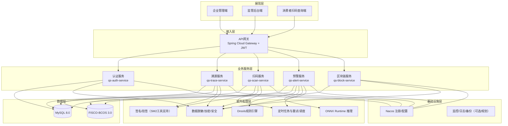
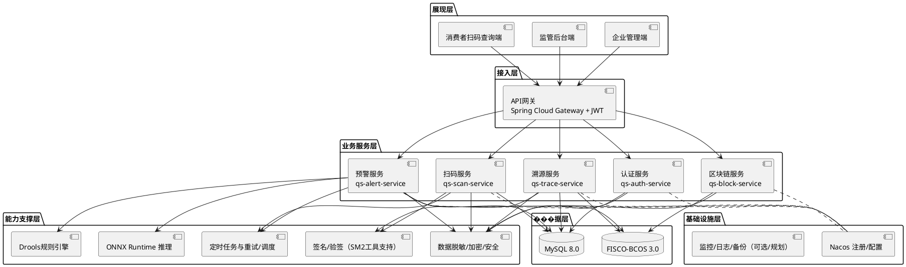

# 系统整体架构图

## Mermaid（论文正式版）

```mermaid
flowchart TB
  %% 展现层
  subgraph L1[展现层]
    FE1["企业管理端"]
    FE2["监管后台端"]
    FE3["消费者扫码查询端"]
  end

  %% 接入层
  subgraph L2[接入层]
    GW["API网关<br/>Spring Cloud Gateway + JWT"]
  end

  %% 业务服务层
  subgraph L3[业务服务层]
    S1["认证服务<br/>qs-auth-service"]
    S2["溯源服务<br/>qs-trace-service"]
    S3["扫码服务<br/>qs-scan-service"]
    S4["预警服务<br/>qs-alert-service"]
    S5["区块链服务<br/>qs-block-service"]
  end

  %% 能力支撑层
  subgraph L4[能力支撑层]
    C1["Drools规则引擎"]
    C2["ONNX Runtime 推理"]
    C3["签名/验签（SM2工具支持）"]
    C4["定时任务与重试/调度"]
    C5["数据脱敏/加密/安全"]
  end

  %% 数据层
  subgraph L5[数据层]
    D1[("MySQL 8.0")]
    D2[("FISCO-BCOS 3.0")]
  end

  %% 基础设施层
  subgraph L6[基础设施层]
    I1["Nacos 注册/配置"]
    I2["监控/日志/备份（可选/规划）"]
  end

  %% 连接关系
  FE1 --> GW
  FE2 --> GW
  FE3 --> GW

  GW --> S1
  GW --> S2
  GW --> S3
  GW --> S4
  GW --> S5

  S1 --> D1
  S2 --> D1
  S3 --> D1
  S4 --> D1
  S5 --> D2

  S2 --> D2
  S4 --> D2

  S3 --> C3
  S4 --> C1
  S4 --> C2
  S2 --> C3

  S3 --> C4
  S4 --> C4

  S1 --> C5
  S2 --> C5
  S3 --> C5
  S4 --> C5
  S5 --> C5

  S1 --- I1
  S2 --- I1
  S3 --- I1
  S4 --- I1
  S5 --- I1
```

## PlantUML（论文正式版）

```plantuml
@startuml
top to bottom direction

package "展现层" {
  [企业管理端] as FE1
  [监管后台端] as FE2
  [消费者扫码查询端] as FE3
}

package "接入层" {
  [API网关\nSpring Cloud Gateway + JWT] as GW
}

package "业务服务层" {
  [认证服务\nqs-auth-service] as S1
  [溯源服务\nqs-trace-service] as S2
  [扫码服务\nqs-scan-service] as S3
  [预警服务\nqs-alert-service] as S4
  [区块链服务\nqs-block-service] as S5
}

package "能力支撑层" {
  [Drools规则引擎] as C1
  [ONNX Runtime 推理] as C2
  [签名/验签（SM2工具支持）] as C3
  [定时任务与重试/调度] as C4
  [数据脱敏/加密/安全] as C5
}

package "���据层" {
  database "MySQL 8.0" as D1
  database "FISCO-BCOS 3.0" as D2
}

package "基础设施层" {
  [Nacos 注册/配置] as I1
  [监控/日志/备份（可选/规划）] as I2
}

FE1 --> GW
FE2 --> GW
FE3 --> GW

GW --> S1
GW --> S2
GW --> S3
GW --> S4
GW --> S5

S1 --> D1
S2 --> D1
S3 --> D1
S4 --> D1
S5 --> D2

S2 --> D2
S4 --> D2

S3 --> C3
S4 --> C1
S4 --> C2
S2 --> C3

S3 --> C4
S4 --> C4

S1 --> C5
S2 --> C5
S3 --> C5
S4 --> C5
S5 --> C5

S1 .. I1
S2 .. I1
S3 .. I1
S4 .. I1
S5 .. I1
@enduml
```

